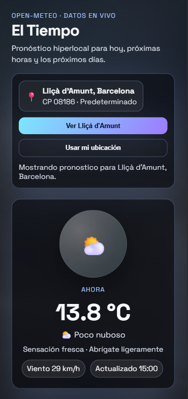
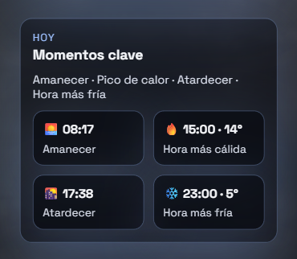
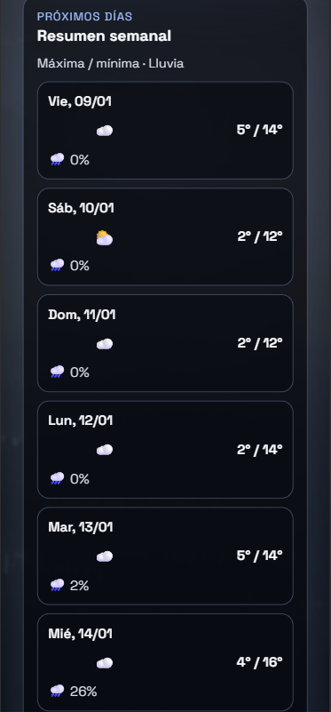
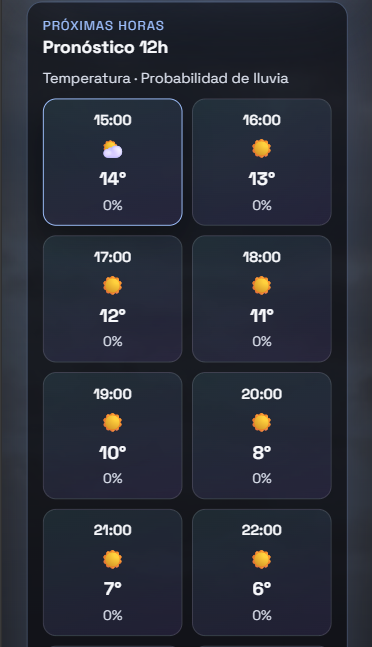

El Tiempo (Api) 🌦️

Aplicación web mobile-first desarrollada en HTML, CSS y JavaScript que consume la API pública Open-Meteo para mostrar el tiempo actual, el pronóstico de las próximas horas y un resumen de los próximos días.

El proyecto está orientado a dispositivos móviles, con una interfaz clara y moderna basada en tarjetas tipo glassmorphism, gradientes suaves y una jerarquía visual pensada para una lectura rápida.

Este proyecto forma parte de un ejercicio individual académico, donde se evalúan tanto la calidad técnica como la organización del código y la documentación.

---------------------------------------------------------------------------------------------

🎯 Objetivo del proyecto

Consumir una API externa real (Open-Meteo).

Mostrar información meteorológica relevante de forma clara y usable en móvil.

Aplicar buenas prácticas de frontend: clean code, estructura de carpetas, responsive design y control de versiones con Git.

Documentar correctamente el proceso, incluyendo el uso de IA generativa como herramienta de apoyo.

---------------------------------------------------------------------------------------------

📍 Funcionalidades principales

Ubicación predeterminada
Lliçà d'Amunt (Barcelona, CP 08186), cargada automáticamente sin solicitar permisos.

Geolocalización opcional
Botón “Usar mi ubicación” para consultar el tiempo real del usuario si concede permisos.

Bloque “Ahora”

Temperatura actual

Estado del cielo

Viento

Mensaje interpretativo (“clima humano”)

Pronóstico próximas 12 horas

Temperatura

Probabilidad de lluvia

Iconos meteorológicos

Resumen semanal

Máxima / mínima diaria

Probabilidad de lluvia claramente indicada

Iconografía robusta y compatible

Timeline del día

Amanecer

Hora más cálida

Atardecer

Hora más fría

---------------------------------------------------------------------------------------------

🛠️ Tecnologías utilizadas

HTML5
Estructura semántica de la aplicación.

CSS3
Diseño responsive, gradientes, glassmorphism, variables CSS y micro-interacciones.

JavaScript (ES6)
Lógica de la aplicación, consumo de la API, procesamiento de datos y renderizado dinámico del DOM.

Open-Meteo API
Proveedor de datos meteorológicos sin necesidad de API key.

---------------------------------------------------------------------------------------------

🌐 API Open-Meteo

Endpoint principal:

https://api.open-meteo.com/v1/forecast

Parámetros utilizados:

latitude, longitude – Coordenadas a consultar.

current_weather=true – Datos actuales (temperatura, viento, código meteorológico).

hourly=temperature_2m,precipitation_probability,weathercode – Pronóstico por horas.

daily=temperature_2m_max,temperature_2m_min,precipitation_probability_max,weathercode,sunrise,sunset – Resumen diario.

timezone=auto – Ajuste automático de la zona horaria.

Coordenadas por defecto:

41.61667, 2.23333 (Lliçà d'Amunt, Barcelona)

---------------------------------------------------------------------------------------------

📂 Estructura del proyecto
El-Tiempo-Api/
│
├── index.html          # Maquetación y layout principal
├── index.css           # Estilos, temas y responsive
├── js/
│   └── app.js          # Lógica, fetch a Open-Meteo y renderizado
│
├── assets/
│   ├── img/            # Fondos dinámicos según el clima
│   └── screenshots/    # Capturas del resultado final
│
└── README.md           # Documentación del proyecto

La estructura está pensada para facilitar la lectura del código y su mantenimiento.

---------------------------------------------------------------------------------------------

🔄 Flujo de funcionamiento

Carga inicial
Se solicita el tiempo de la ubicación predeterminada sin pedir permisos.

Geolocalización (opcional)
Si el usuario lo desea, puede activar su ubicación para ver su propio pronóstico.

Procesamiento de datos
Los datos recibidos de la API se normalizan y se mapean a textos, iconos y temas visuales seguros.

Renderizado dinámico
Se muestran los bloques:

Ahora

Timeline del día

Próximas horas

Resumen semanal

Gestión de errores
Mensajes claros si falla la conexión o la geolocalización.

---------------------------------------------------------------------------------------------

🚀 Despliegue

La aplicación está publicada en GitHub Pages:

👉 https://AlbaGG95.github.io/El-Tiempo-Api/

---------------------------------------------------------------------------------------------

🔧 Control de versiones

Trabajo con ramas (dev, feat/*, fix/*).

Uso de conventional commits (feat, fix, chore, docs).

main contiene únicamente la versión final estable lista para despliegue.

---------------------------------------------------------------------------------------------

🤖 Uso de Inteligencia Artificial

Se ha utilizado IA generativa como herramienta de apoyo durante el desarrollo para:

Proponer mejoras de UX/UI.

Ayudar en la organización del código y la estructura del proyecto.

Revisar la documentación y los textos del README.

Detectar y corregir errores lógicos (mapeo de códigos meteorológicos, iconos, etc.).

Importante:
La IA no ha generado el proyecto de forma automática.
Todo el código ha sido entendido, probado, adaptado y validado manualmente, incluyendo pruebas en resolución móvil y revisión de cada cambio antes de integrarlo.

📸 Captura del resultado

### Vista principal (móvil)

### Pronóstico por horas

### Resumen semanal

### Momentos clave del día

---------------------------------------------------------------------------------------------

✍️ Autoría

Proyecto desarrollado de forma individual como ejercicio académico de frontend, siguiendo las indicaciones del enunciado y buenas prácticas de desarrollo web.